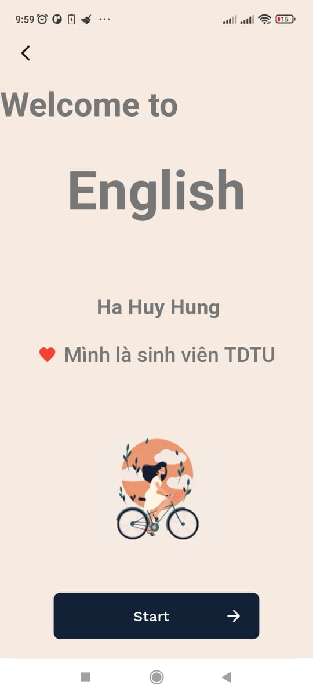
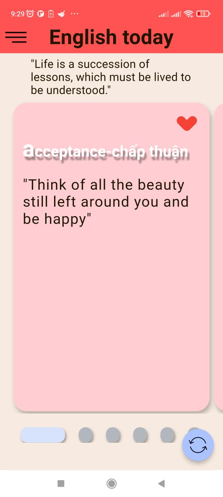
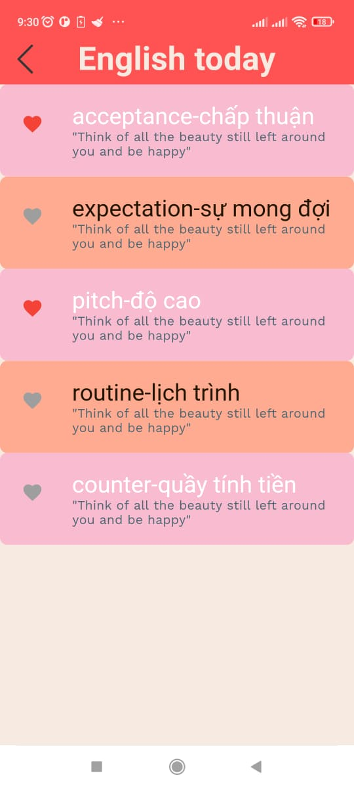

# Learn_English_Today
Ứng dụng học tiếng anh  trên Android được tạo bằng Flutter sử dụng các API Android như english_words,shared_preferences,... 
## Features
- Flutter UI: Giao diện người dùng và hình ảnh động nâng cao.
- english_words + quoctes : Gồm nhiều từ vựng với cách hiện thị sống động, có thể note lại từ vựng và tăng số từ
## Screenshots
|  |  |  |  |
|----------|:-------------:|:-------------:|:-------------:|
|  |  |  |  |
|----------|:-------------:|:-------------:|:-------------:|